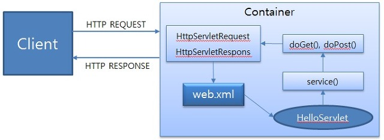
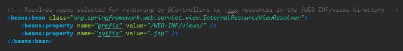
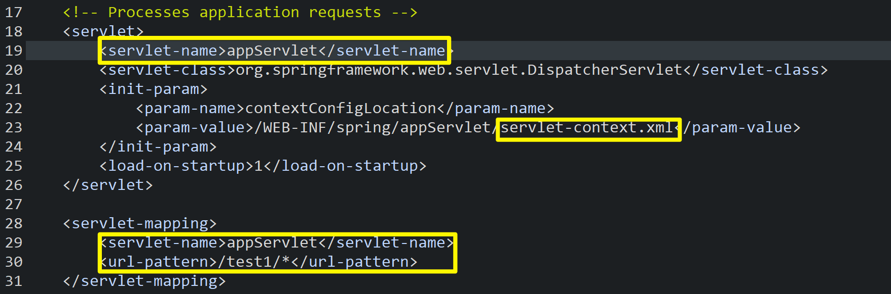
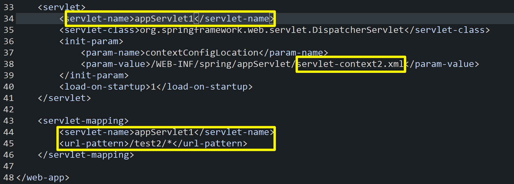
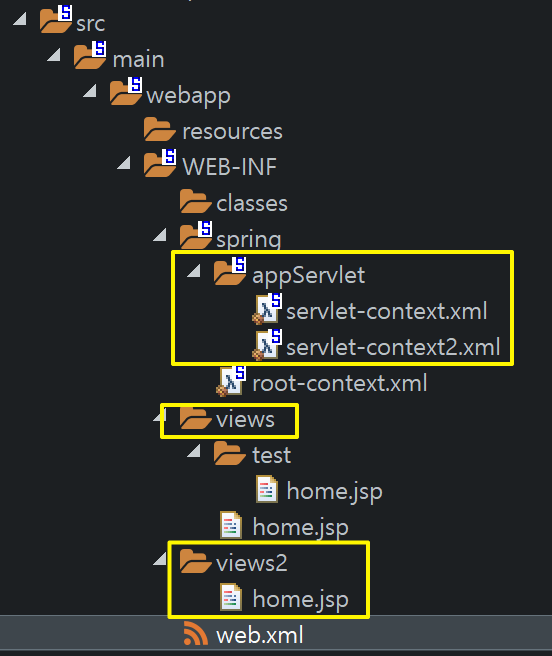
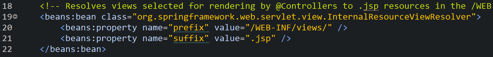
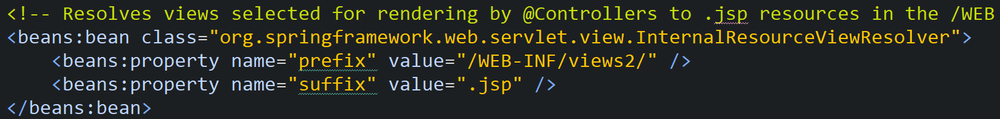
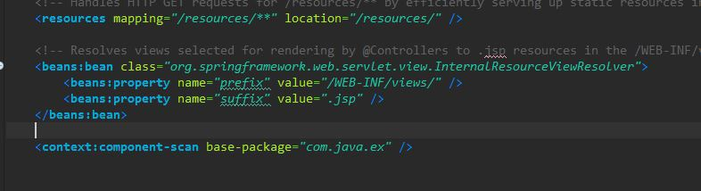

## ClassPathXmlApplicationContext

```java
ApplicationContext factory = new ClassPathXmlApplicationContext("member/member.xml");
MemberVO vo = factory.getBean("vo", MemberVO.class);
MemberDAO dao = factory.getBean("dao", MemberDAO.class);
```

## AnnotationConfigApplicationContext

출처: https://engkimbs.tistory.com/685 

Xml파일에 직접 IOC 컨테이너에서 모든 서블릿에 공통적으로 사용될 Bean 객체를 서술하지 않아도, 자바 파일에 **@Configuration** 과 **@Bean**을 활용해 등록할 수 있다.

getBean시 Object가 반환되므로 Type형을 2번째 매개변수로 지정.

```java
@Configuration
public class JavaConfig {

    @Bean
    public Gun gun() {
        return new Gun();
    }

    @Bean
    public Knife knife() {
        return new Knife();
    }

    @Bean
    public Player gunPlayer() {
        return new Player(gun());
    }

    @Bean
    public Player knifePlayer() {
        return new Player(knife());
    }
}
```

```java
@Configuration
public class JavaConfig2 {

    @Bean
    public Bow bow() {
        return new Bow();
    }

    @Bean
    public Player bowPlayer() {
        return new Player(bow());
    }
}
```

### **[ Spring Bean 구성 요소 ]**

- class: Bean으로 등록할 Java 클래스 
- id: Bean의 고유 식별자 
- scope: Bean을 생성하기 위한 방법(singleton, prototype 등) 
- constructor-arg: Bean 생성 시 생성자에 전달할 파라미터 
- property: Bean 생성 시 setter에 전달할 인수 

## @Controller 태그

Controller는 View에 Model을 넘겨주는 역할. Model은 그렇다면 데이터를 담는 상자역할 인것인가.

## Web.xml 설정파일

```java
	<!-- Processes application requests -->
	<servlet>
		<servlet-name>appServlet</servlet-name>
		<servlet-class>org.springframework.web.servlet.DispatcherServlet</servlet-class>
		<init-param>
			<param-name>contextConfigLocation</param-name>
			<param-value>/WEB-INF/spring/appServlet/servlet-context.xml</param-value>
		</init-param>
		<load-on-startup>1</load-on-startup>
	</servlet>
		
	<servlet-mapping>
		<servlet-name>appServlet</servlet-name>
		<url-pattern>/</url-pattern>
	</servlet-mapping>
```

appServlet = DispatcherServlet ====> / , web에서 모든 요청처리를 DispatcherServlet을 거치게 만들겠다는 의미, Front Controller 패턴 의미.

## Servlet(Common Gateway Interface)

출처 : https://ddo-o.tistory.com/77

과거 시대에는 웹의 Response응답 시 Servlet으로 Front-End와 Back-End를 동시에 구현시켰다. 하지만 시스템이 복잡해지고 표현해야 하는 웹 컨텐츠가 많아질 수록 코드가 길어져 가독성이 안좋아지며 보수가 힘들게 된다. 이를 해결하기 위해 JSP(Java Server Page)을 도입하여 시각적 부문을 처리하는 Front-End와 응용 서비스 부문을 처리하는 Back-End로 나눠지게 되었다.



<기본적 동작 이론>

* Client가 특정 URL을 활용하여 Tom-cat Server에 요청하게 된다면,  HTTP Listener라는 수신 소켓을 활용하여 받아들이고 Static자원(HTML)을 반환하거나 Dynamic자원(JSP,Servlet)을 엔진을 통해 계산하기 시작한다.
* Servlet요청 시, IOC Container(Servlet Container)는 HttpServletRequest, HttpServletResponse 두 객체를 생성한다.
* 요청한  URL을 DD(Deployment Descriptor)/Web.xml을 통해 어떤 Servlet을 호출해야하는지 찾는다. (DispatcherServlet을 생성하게 되는 경우, 이는 Front-Controller구조. 주로 모델2)
* IOC Container는 Servlet의 service메소드를 호출하고, POST GET여부에 따라 doGet() doPost()가 호출된다.
* 선택된 메소드는 동적 페이지를 생성한 후, HttpServletResponse 객체를 이용해 응답한다.
* 응답이 완료되면 IOC Container가 HttpServletRequest, HttpServletResponse 두 객체를 소멸시킨다.

## Controller 여러개 사용하기

출처 : https://developernotes.tistory.com/entry/Spring-MVC-Servlet-contextxml-%EC%97%AC%EB%9F%AC%EA%B0%9C-%EC%82%AC%EC%9A%A9%ED%95%98%EA%B8%B0-viewResolver-%EC%97%AC%EB%9F%AC%EA%B0%9C-%EC%82%AC%EC%9A%A9%ED%95%98%EA%B8%B0

https://songsunbi.tistory.com/9

#### <IOC Container 세부 작동 순서>

* client -> 
* web.xml/servlet mapping/url pattern ->
*  web.xml/servlet/DispathcerServlet -> 
* servlet-context.xml 에서 base-package 스캔 ->
*  @Controller 어노테이션이 있는 클래스 -> 
* 클래스 안의 메소드 실행 -> 
* view 페이지 이름 리턴  
  * *view페이지 이름 리턴시, 다시한번 servlet-context.xml에서 처리.*
  * 

(MVC 패턴, 모델 2, Front-Controller 구조.)

web.xml에서 url에 따른 호출되는 Servlet-context 분리시킨다.

**URL /test1일때 동작 루트를 servlet-context.xml로 설정**

* 

**URL /test2일때 동작 루트를 servlet-context2.xml로 설정**

* 

* 

**현재 appServlet 폴더에 2개의 다른 Servlet-context가 분리되어 존재.**

**추후, View 이름 리턴시에, web-servlet.xml을 다시 참조하여 확장자명을 붙여준다.**

* **servlet-context.xml**



* **servlet-context2.xml**






Servlet-context에는 base-package, 사용자가 설정한 패키지안의 자바파일을 스캔해서 @Controller라는 Annotation을 가진 파일을 Controller로 사용.

#### 즉, 마지막으로 Package를 2개로 분리하여 각각 하나의 @Controller를 공급.

**2개의 Controller를 활용할 수 있게 된다.**